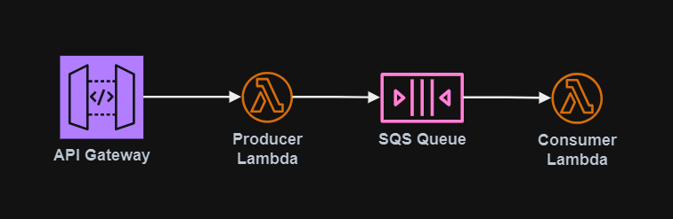

# API Gateway with Lambda services

In case you need a simple API solution with Lambda "nano" services, this is a small sample project with AWS SAM. Make sure to [choose between][1] the HTTP and REST API models. Look into the best authentication model, and add appropriate monitoring and tracing capabilities.



Run the commands from the `integration` directory:

```sh
cd integration
```

Build and deploy the application:

```sh
sam build
sam deploy --guided
```

Services will be available using `POST` published in the API Gateway endpoint in the `$default` stage:

```
curl -X POST https://<api-id>.execute-api.us-east-2.amazonaws.com/documents
```

## Commands

Commands reference:

```sh
sam init --name integration --package-type Zip --architecture arm64 --runtime java21
sam build
sam validate
sam local invoke
sam sync --stack-name {{stack-name}} --watch
sam deploy --guided
sam local generate-event sqs receive-message --body '{"hello": "world"}'
sam local invoke ServerlessConsumerFunction --event events/sqs.json
sam delete
```

## Sources

- [AWS::Serverless::HttpApi](https://docs.aws.amazon.com/serverless-application-model/latest/developerguide/sam-resource-httpapi.html)
- [AWS - API Gateway HTTP API JWT authorizer](https://docs.aws.amazon.com/apigateway/latest/developerguide/http-api-jwt-authorizer.html)
- [AWS - SAM HTTP API OAuth2 authorizer](https://docs.aws.amazon.com/serverless-application-model/latest/developerguide/sam-property-httpapi-oauth2authorizer.html)
- [AWS - GitHub Java SDK v2 SQS Sample](https://github.com/awsdocs/aws-doc-sdk-examples/tree/main/javav2/example_code/sqs)
- [AWS - Lambda SQS sample](https://docs.aws.amazon.com/lambda/latest/dg/with-sqs-example.html)
- [Medium - API Gateway with AWS SAM template](https://medium.com/carsales-dev/api-gateway-with-aws-sam-template-c05afdd9cafe)
- [SO - Run SQS locally with AWS SAM](https://stackoverflow.com/questions/70776865/run-sqs-on-aws-sam-locally-is-it-possible)

[1]: https://docs.aws.amazon.com/apigateway/latest/developerguide/http-api-vs-rest.html
